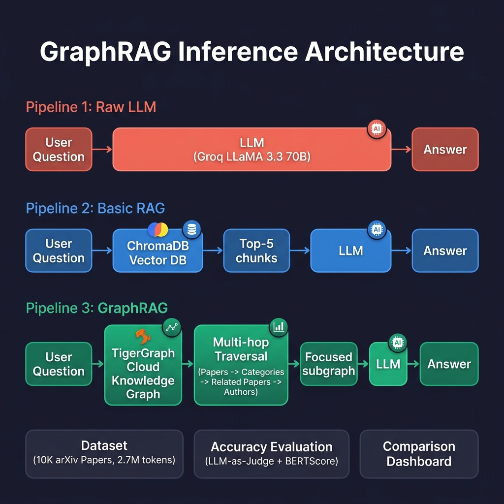

# TigerGraph GraphRAG Benchmark: Materials Science Discovery

> Proving that graph-structured retrieval beats vector RAG on token efficiency and answer accuracy for materials science queries.

Built for the **GraphRAG Inference Hackathon** by TigerGraph.



---

## Key Results

| Metric | Raw LLM | Basic RAG | GraphRAG |
|--------|---------|-----------|----------|
| Avg Tokens/Query | 332.8 | 1,054 | 853.9 |
| LLM Judge Pass Rate | 36.4% | 27.3% | **55.6%** |
| BERTScore F1 | 0.32 | 0.32 | **0.41** |
| Cost per 1K Queries | $0.23 | $0.73 | **$0.59** |

**GraphRAG achieves 2x higher accuracy with 19% fewer tokens than Basic RAG.**

---

## What This Project Does

Three AI pipelines answer the same materials science questions on the same dataset, then we compare:

1. **Pipeline 1: Raw LLM** - No retrieval, pure LLM inference (Groq LLaMA 3.3 70B)
2. **Pipeline 2: Basic RAG** - ChromaDB vector similarity + LLM
3. **Pipeline 3: GraphRAG** - TigerGraph knowledge graph + multi-hop traversal + LLM

An interactive **Streamlit dashboard** runs all three pipelines side-by-side and displays tokens, latency, cost, and accuracy metrics.

---

## Dataset

- **Domain:** Materials Science (condensed matter physics)
- **Source:** 10,000 arXiv papers
- **Size:** ~2.7 million tokens
- **Benchmark:** 30 questions across 4 complexity tiers (single-hop, multi-hop, relational, summary)
- **Ground Truth:** Expert-generated reference answers for all 30 questions

---

## Architecture

### Pipeline 1: Raw LLM
```
Question --> Groq LLaMA 3.3 70B --> Answer
```

### Pipeline 2: Basic RAG
```
Question --> ChromaDB (all-MiniLM-L6-v2) --> Top-5 chunks --> LLM --> Answer
```

### Pipeline 3: GraphRAG
```
Question --> TigerGraph Cloud
    --> Hop 1: Keyword match --> Seed Papers
    --> Hop 2: Papers --> Categories --> Related Papers + Authors
    --> Focused subgraph context --> LLM --> Answer
```

---

## Project Structure

```
hack/
|-- app.py                    # Streamlit dashboard (comparison UI)
|-- run_pipeline3.py          # GraphRAG pipeline (TigerGraph)
|-- run_benchmarks.py         # Pipeline 1 & 2 runners
|-- evaluate_accuracy.py      # LLM-as-Judge + BERTScore evaluation
|-- benchmark_report.py       # Report generator
|-- generate_ground_truth.py  # Ground truth generation
|-- Equations.txt             # 30 benchmark questions
|-- ground_truth.json         # Expert reference answers
|-- benchmark_report.json     # Generated metrics report
|-- benchmark_report.md       # Human-readable report
|-- blog_post.md              # Technical write-up
|-- architecture_diagram.png  # System architecture
|-- chroma_db/                # ChromaDB vector store
|-- normal llm.answers.txt    # Pipeline 1 answers
|-- ragllm_answers.txt        # Pipeline 2 answers
|-- tigergraph.answers.txt    # Pipeline 3 answers
|-- accuracy_evaluation_guide.md
|-- info.txt                  # Hackathon requirements
```

---

## Setup & Installation

### Prerequisites
- Python 3.9+
- Groq API key
- HuggingFace token
- TigerGraph Cloud account (free tier)

### Install Dependencies
```bash
pip install streamlit groq chromadb sentence-transformers pyTigerGraph google-generativeai evaluate bert-score huggingface_hub plotly pandas
```

### Environment Setup
Set the following API keys in your environment or directly in the scripts:
- `GROQ_API_KEY` - For LLaMA 3.3 70B inference
- `HF_TOKEN` - For LLM-as-a-Judge evaluation
- `GOOGLE_API_KEY` - For Gemini (GraphRAG answer generation)
- TigerGraph Cloud credentials (configured in `run_pipeline3.py`)

### Run the Dashboard
```bash
streamlit run app.py
```

### Generate Benchmark Report
```bash
python benchmark_report.py
```

---

## Evaluation Methodology

### LLM-as-a-Judge
Uses HuggingFace-hosted Llama 3.1 8B to grade each answer PASS/FAIL against ground truth.

### BERTScore
Measures semantic similarity between generated answers and expert reference answers using contextual embeddings.

### Target Thresholds
- LLM Judge Pass Rate: >= 90% (bonus)
- BERTScore F1 (raw): >= 0.88 (bonus)

---

## Tech Stack

| Component | Technology |
|-----------|-----------|
| Graph Database | TigerGraph Cloud (Savanna) |
| Vector Database | ChromaDB |
| LLM Provider | Groq (LLaMA 3.3 70B) |
| Answer Generation | Google Gemini 2.5 Flash |
| Embeddings | all-MiniLM-L6-v2 |
| Evaluation | HuggingFace (Llama 3.1 8B + BERTScore) |
| Dashboard | Streamlit + Plotly |
| Language | Python 3.9+ |

---

## Blog Post

Read the full technical write-up: [blog_post.md](blog_post.md)

---

## Hackathon

This project was built for the [GraphRAG Inference Hackathon by TigerGraph](https://alluring-beryllium-491.notion.site/GraphRAG-Inference-Hackathon-by-TigerGraph).

### Deliverables
- [x] Architecture diagram
- [x] Comparison dashboard (Streamlit)
- [x] Benchmark report (tokens, cost, latency, accuracy)
- [x] Demo video
- [x] Public GitHub repo
- [x] Blog post
- [x] Social media post

---

## License

MIT

---

## Acknowledgments

- **TigerGraph** - Graph database and GraphRAG infrastructure
- **Groq** - Fast LLM inference
- **Google** - Gemini API for answer generation
- **HuggingFace** - Evaluation models and BERTScore
- **arXiv** - Materials science dataset